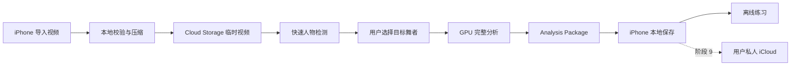
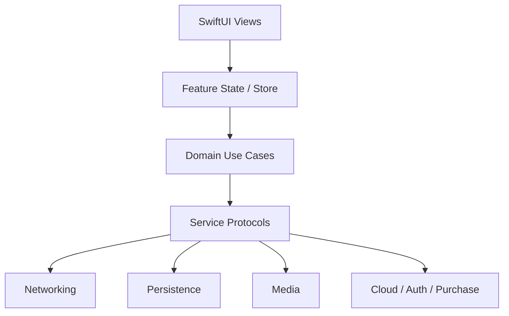
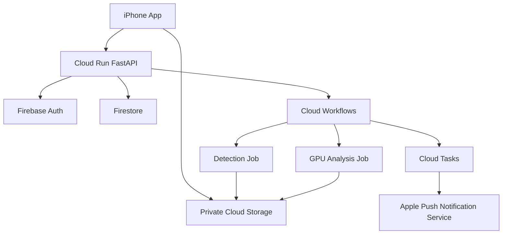

# Stage Lab 云端分析商品化设计规格

**状态：** 已确认

**日期：** 2026-07-10

**当前工程：** SwiftUI iPhone Demo

**目标：** 先完成一个真实 AI、可恢复、可测试、受成本约束的商用级 Demo，再逐阶段完善为可公开上架的商品级 App。

## 1. 给初学者的整体认识

这个产品不是只有一个 App。完整系统由五部分组成：

1. **iPhone App**：负责导入视频、展示任务状态、选择舞者、播放和离线练习。
2. **云端 API**：负责验证身份、签发上传地址、创建任务、查询状态和返回结果。
3. **临时云存储**：接收视频并在规定时间后自动删除。
4. **AI 后台任务**：读取视频，识别和追踪舞者，生成动作时间轴与难点。
5. **用户数据存储**：项目和分析结果长期保存在本机，后续同步到用户自己的私人 iCloud。

最重要的数据流是：



## 2. 已确认的产品边界

### 2.1 用户与视频

- 面向 13 岁及以上的零基础、初级和进阶 K-pop 翻跳学习者。
- 正式支持 iPhone；iPad 只保证兼容运行，不做首版专门优化。
- 开发和个人 TestFlight 阶段只使用简体中文。
- 首发市场计划为日本、美国、香港、台湾等中国大陆以外地区。
- 公开上架前增加英文、日文和繁体中文。
- 只从 iPhone 相册或“文件”App 导入本地视频。
- 不支持 YouTube、TikTok 或其他平台链接下载。
- 单个视频最长 6 分钟。
- 主要支持练习室固定机位视频，允许轻微镜头移动和少量剪辑。
- 基本要求是大部分时间全员、全身可见。

### 2.2 云端分析结果

- 快速检测视频中的主要舞者并返回多个代表画面。
- 用户选择一个目标舞者后才启动完整分析，避免无意义地分析所有人。
- 自动追踪目标舞者；剪辑、遮挡或换位导致低置信度时要求用户确认。
- 有效画面中的目标追踪正确率验收目标约为 90%。
- 自动按音乐与动作变化生成练习片段。
- 动作节点与实际变化的误差目标不超过 0.5 秒。
- 难点必须说明原因，例如动作速度快、方向变化多、连续转身或队形移动大。
- 用户可以新增、删除和调整时间轴节点。
- 标准 6 分钟视频目标在 3–8 分钟内完成分析。
- 用户视频默认不用于训练，也不由人工查看。

### 2.3 练习体验

- 保留完整队形，用跟随目标人物的柔和聚光圈突出舞者，圈外轻微变暗。
- 第一版不生成逐帧精确人物遮罩；SAM 2 精确轮廓属于后续升级。
- 支持播放、暂停、镜像、变速、逐帧、节点跳转和片段循环。
- 默认界面保持简单；精确时间码、循环次数等放在可展开的高级控制中。
- 自动记录每个片段的练习时长和循环次数。
- 是否“已掌握”只能由用户手动标记。
- 已完成分析的项目支持离线练习。
- 第一版不包含自拍动作评分、社交、视频导出或公开分享。

### 2.4 账号、数据和收费

- 本地导入和基础播放无需登录。
- 第一次使用云端分析时要求 Sign in with Apple。
- 新用户正式商品化后赠送 1 次完整分析，之后销售分析次数包。
- 商用级 Demo 使用测试额度，不接入真实付费。
- 正式次数包价格必须在 20 条基准视频测得真实单次成本后确定。
- 失败分析不消耗额度。
- 原视频在 Google Cloud 最长保留 24 小时。
- 分析结果在云端最长保留 7 天用于中断恢复，领取后长期保存在本机或私人 iCloud。
- 视频默认只保存在本机，不自动同步到 iCloud。
- 删除项目会删除本机与私人 iCloud 中的项目数据，并立即请求删除云端临时内容。
- 默认只在 Wi-Fi 下上传；用户确认后可允许单次移动网络上传。

## 3. 技术选型

### 3.1 iPhone

| 能力 | 技术 | 用途 |
|---|---|---|
| UI | SwiftUI | 页面、组件、状态展示和导航 |
| 本地模型 | SwiftData | 项目索引、任务状态、时间轴修改和练习进度 |
| 大文件 | FileManager / Application Support | 视频副本与 Analysis Package |
| 安全凭证 | Keychain | 登录凭证和设备安全状态 |
| 视频 | AVFoundation / AVPlayer | 校验、压缩、缩略图、播放、变速和逐帧 |
| 并发 | Swift Concurrency | async/await、Task、actor 和取消 |
| 登录 | Firebase Authentication + Sign in with Apple | 云端用户身份 |
| 通知 | APNs | 分析完成、需要确认和失败通知 |
| 私人同步 | CloudKit Private Database | 阶段 9 同步项目与分析结果 |
| 内购 | StoreKit 2 | 阶段 10 销售次数包和恢复购买 |
| 最低系统 | iOS 18.0 | 与当前工程 Deployment Target 一致 |
| 开发工具 | Xcode 26.6 / Swift toolchain 6.3.3 | 当前本机验证环境 |

项目会逐步启用更严格的 Swift 并发检查，但不会在同一个提交中同时重构全部页面和切换全部语言模式。

### 3.2 云端

| 能力 | 技术 | 用途 |
|---|---|---|
| API | Python + FastAPI + Pydantic | `/v1` HTTP API 与数据校验 |
| API 运行 | Google Cloud Run | HTTPS 服务，空闲缩容到零 |
| 身份验证 | Firebase Admin SDK | 验证 Firebase ID Token |
| 任务编排 | Google Cloud Workflows | 检测、等待选择、分析、结果和通知状态 |
| 异步通知 | Cloud Tasks | APNs 发送和可重试工作 |
| 业务记录 | Firestore | 用户、任务、设备和额度流水 |
| 临时文件 | Cloud Storage | 原视频、候选图、检查点和结果包 |
| AI 运行 | Cloud Run Jobs + GPU | 按任务运行检测和完整分析 |
| 容器 | Docker + Artifact Registry | 可重复构建 API 和 Worker |
| 机密 | Secret Manager | APNs 密钥等服务端机密 |
| 日志监控 | Cloud Logging / Monitoring | 错误、性能、任务和成本指标 |
| 基础设施 | Terraform | 创建 dev、staging、production 环境 |
| 自动化 | Google Cloud Build | 测试、构建容器和部署到对应环境 |

云端分析部署在 Google Cloud 新加坡区域。它满足亚洲区域、按需 GPU 和早期成本控制要求。视频只做临时处理。

### 3.3 AI

| 步骤 | 技术 | 输入 | 输出 |
|---|---|---|---|
| 媒体检查 | FFprobe | 上传对象 | 编码、时长、尺寸、帧率和有效性 |
| 标准化 | FFmpeg | 原视频 | 1080 长边播放代理、分析代理和音频 |
| 人体检测 | RTMDet | 代表帧 / 分析帧 | 人物框、可见度和置信度 |
| 多目标追踪 | ByteTrack | 连续人物框 | 连续轨迹 ID |
| 身份恢复 | OSNet-x0.25 Re-ID 基线 | 人物裁剪与断裂轨迹 | 剪辑或遮挡后的身份匹配 |
| 姿态 | RTMPose | 目标舞者图像 | 身体关键点、可见度和运动特征 |
| 音频 | librosa / 可替换音频模块 | 单声道音频 | BPM、节拍、强拍和段落变化 |
| 动作节点 | 可解释时序规则 | 姿态、位移和节拍 | 可编辑练习片段 |
| 难点 | 可解释规则 | 速度、方向、转身和位移 | 难点原因与建议速度 |
| 聚光效果 | App 本地插值渲染 | 目标框关键帧 | 30 fps 柔和聚光圈 |

首版不调用 OpenAI、Gemini 或 Claude 来完成视频追踪。这些通用模型不适合承担逐帧多人身份追踪。后续只有在需要自然语言教学建议时才重新评估。

## 4. iPhone App 架构

### 4.1 调用方向



View 只能读取可展示状态并发送用户动作。View 不直接构造 URLRequest、不直接写文件、不直接更新额度，也不直接访问 CloudKit。

### 4.2 目标目录

```text
kpop/
  App/
    StageLabApp.swift
    AppEnvironment.swift
    RootView.swift
  Router/
    AppRouter.swift
    Route.swift
  Domain/
    Models/
    AnalysisStateMachine.swift
    UseCases/
  Core/
    Networking/
    Persistence/
    Media/
    Services/
    Observability/
  Features/
    Home/
    Import/
    Analysis/
    DancerSelection/
    Practice/
    Settings/
  DesignSystem/
  Resources/
kpopTests/
kpopUITests/
```

### 4.3 核心类型职责

- `StageLabApp`：唯一 `@main` 入口，创建持久化容器和依赖环境。
- `AppEnvironment`：集中持有协议类型的服务，不保存页面瞬时状态。
- `AppRouter`：管理 `NavigationStack` 路由。
- `DanceProject`：SwiftData 项目索引，不承载大体积逐帧数组。
- `AnalysisJob`：本地保存远端 `jobId`、状态、进度和错误码。
- `AnalysisStateMachine`：验证状态能否转换，防止页面随意跳阶段。
- `AnalysisPackageStore`：原子写入、读取、校验和迁移分析包。
- `VideoFileStore`：管理 Application Support 内的视频副本。
- `APIClient`：统一发送请求、附加 Token、解析错误和处理重试。
- `UploadService`：取得签名 URL、执行后台上传和恢复任务。
- `AnalysisService`：创建任务、选择舞者、确认身份和领取结果。
- `SpotlightRenderer`：根据轨迹关键帧在播放器上绘制聚光圈。
- `FakeAnalysisService`：供 Preview、单元测试和 UI 测试使用。

### 4.4 分析状态机

```text
draft
  -> preparing
  -> uploading
  -> uploaded
  -> detecting
  -> awaitingTarget
  -> queued
  -> analyzing
  -> awaitingConfirmation -> analyzing
  -> resultReady
  -> importing
  -> completed

任何可运行状态 -> failedRecoverable / failedTerminal
任何未完成状态 -> cancelling -> deleted
```

状态转换由 Domain 层验证。网络重试必须带幂等键，相同操作不会重复创建任务。

## 5. API 规格

所有正式接口使用 HTTPS、`/v1` 前缀、JSON 请求与响应。除签名上传 URL 外，请求使用 `Authorization: Bearer <Firebase ID Token>`。所有写请求携带 `Idempotency-Key`。

| 顺序 | API | 呼入 | 呼出 | 副作用 |
|---|---|---|---|---|
| 1 | `POST /v1/uploads` | 文件大小、时长、MIME、SHA-256 | `uploadId`、签名 PUT URL、过期时间 | 创建上传记录 |
| 2 | `PUT <signed-url>` | 压缩视频字节 | Storage 状态 | 视频直传私有 Bucket |
| 3 | `POST /v1/uploads/{id}/complete` | `uploadId`、对象校验值 | `jobId`、`detecting` | 校验对象并启动快速检测 |
| 4 | `GET /v1/jobs/{id}` | `jobId` | 状态、进度、错误码、下一动作 | 无 |
| 5 | `GET /v1/jobs/{id}/dancers` | `jobId` | 候选 ID、代表图 URL、出现区间、置信度 | 无 |
| 6 | `POST /v1/jobs/{id}/target` | `candidateId` | `queued` | 锁定目标并启动 GPU 分析 |
| 7 | `POST /v1/jobs/{id}/confirmations` | 时间点与重新选择的候选 | `analyzing` | 从检查点恢复任务 |
| 8 | `GET /v1/jobs/{id}/result` | `jobId` | schema 版本、SHA-256、下载 URL | 无 |
| 9 | `POST /v1/jobs/{id}/acknowledge` | 结果版本与本地校验值 | `completed` | 标记已安全领取 |
| 10 | `DELETE /v1/jobs/{id}` | `jobId` | `cancelling/deleted` | 终止任务并清理临时对象 |

APNs 推送只包含 `jobId` 和事件类型。App 收到推送后调用 `GET /v1/jobs/{id}` 获取真实状态，推送内容不作为可信业务数据。

## 6. 数据存储规格

### 6.1 本机

`DanceProject` 至少包含：

- `id: UUID`
- `title: String`
- `sourceVideoRelativePath: String?`
- `sourceFingerprint: String`
- `durationSeconds: Double`
- `phase: ProjectPhase`
- `selectedDancerId: String?`
- `remoteJobId: String?`
- `analysisSchemaVersion: Int?`
- `analysisPackageRelativePath: String?`
- `createdAt: Date`
- `updatedAt: Date`
- `lastPracticedAt: Date?`

大体积结果保存为 `result-v1.zip`：

```text
result-v1.zip
  manifest.json
  spotlight-track.bin
  pose-track.bin
  timeline.json
  confidence.json
```

`manifest.json` 保存 schema 版本、模型版本、视频指纹、时间基准、各文件哈希和生成时间。App 先下载到临时目录，全部校验通过后再原子移动到项目目录。

### 6.2 Firestore

- `users/{uid}`：创建时间、状态、地区和已接受的隐私版本。
- `jobs/{jobId}`：`ownerUid`、状态、进度、输入规格、目标候选、模型版本、错误码、成本和过期时间。
- `entitlementLedger/{entryId}`：赠送、预留、消费、返还和购买流水，只追加不覆盖。
- `devices/{deviceId}`：加密后的 APNs Token、通知设置和最后活跃时间。

Firebase UID 是云端主键。Apple 邮箱不作为业务主键，也不保存不必要的明文身份信息。

### 6.3 Cloud Storage

```text
jobs/{uid}/{jobId}/source.mp4
jobs/{uid}/{jobId}/candidates/*.jpg
jobs/{uid}/{jobId}/checkpoints/*
jobs/{uid}/{jobId}/result-v1.zip
```

- Bucket 永不公开。
- 客户端不能列出目录。
- 原视频最长 24 小时。
- 候选图和检查点随任务完成、失败或删除而清除。
- 结果包最长 7 天。
- 删除 API 触发立即清理，生命周期规则是最后一道兜底。

## 7. 云端内部架构



### 7.1 后端目录

```text
backend/
  api/
    app/
      main.py
      routes/
      auth/
      services/
      repositories/
      schemas/
      errors/
    tests/
    Dockerfile
  workers/
    detection/
    analysis/
  shared/
    contracts/
    state/
    storage/
    observability/
  tests/
infra/
  terraform/
    modules/
    environments/
      dev/
      staging/
      production/
```

API、Detection Job 和 Analysis Job 使用不同的服务账号。它们只能访问完成自身职责所需的集合与对象路径。

## 8. AI 处理规格

### 8.1 处理顺序

1. FFprobe 检查文件真实性、时长、轨道、分辨率和帧率。
2. FFmpeg 生成固定时间基准的分析代理与音频。
3. 采样代表帧并过滤严重模糊帧。
4. RTMDet 检测人物并生成舞者候选。
5. 用户选择目标舞者。
6. RTMDet 与 ByteTrack 建立连续轨迹。
7. OSNet-x0.25 Re-ID 基线在剪辑、遮挡和轨迹断裂后恢复身份；如未通过基准测试，只允许在保持相同协议的前提下替换实现。
8. 置信度闸门标记不能可靠自动判断的时间点。
9. RTMPose 提取目标舞者姿态关键点。
10. 音频模块提取节拍和段落；无清晰音乐时使用动作分段。
11. 时序规则生成动作变化节点和练习片段。
12. 难点规则生成原因与建议慢速比例。
13. 输出带版本和哈希的 Analysis Package。

### 8.2 聚光轨迹

首版结果不包含逐帧图片。轨迹保存稀疏关键帧：

- `timeSeconds`
- `centerX / centerY`，使用 0–1 归一化坐标
- `width / height`
- `visibility`
- `confidence`
- `interpolationMode`

App 根据视频显示尺寸、镜像状态和当前时间插值。低置信度区间不显示强确定性光圈，可使用弱化样式或提示用户确认。

### 8.3 基准集

个人测试阶段建立 20 条合法持有的练习室视频基准集，覆盖：

- 3–12 人队形。
- 浅色与深色服装。
- 轻微镜头移动。
- 少量剪辑。
- 人物交叉、短暂遮挡与快速换位。
- 不同清晰度、帧率和歌曲速度。

基准视频不提交到 Git。标注文件使用内部视频 ID，不包含艺人或用户身份信息。

## 9. 错误处理与恢复

### 9.1 重试原则

- Token 过期：静默刷新一次，失败后要求重新登录。
- 上传断网：保存 `uploadId`，网络恢复后继续或重新取得 URL。
- HTTP 429：遵循 `Retry-After`。
- HTTP 5xx：指数退避并加入随机抖动，限制最大次数。
- 输入 4xx：不自动重试，显示可执行的用户说明。
- GPU 暂无容量：任务保持排队，不重复创建或收费。
- Worker 暂时失败：从检查点自动重试一次。
- 结果哈希错误：拒绝导入、保留旧数据并重新下载。
- 无法可靠分析：明确结束为失败并返还测试额度。

### 9.2 隐私错误信息

用户界面显示易懂说明；日志记录稳定错误码。错误信息不得包含 Token、签名 URL、用户标题、原始文件名或视频截图。

## 10. 安全和隐私

- 所有传输使用 HTTPS。
- API 验证 Token 的 issuer、audience、签名和有效期。
- 每次资源读取同时校验 `ownerUid`。
- 上传 URL 短期有效，绑定对象路径、MIME 和大小限制。
- Secret Manager 保存 APNs 等服务端密钥。
- Git、App 包和普通配置文件不保存长期云密钥。
- dev、staging、production 使用不同项目、Bucket、身份和数据库。
- Firebase App Check 与服务端限流共同降低滥用。
- App 内提供删除项目和删除账号入口。
- 用户视频默认不训练、不人工查看、不公开分享。
- 正式上架前完成隐私政策、数据保留说明、App Privacy 表单和 iOS Privacy Manifest。

## 11. 成本规格

- Cloud Run API `minimum instances = 0`。
- GPU Job 只在任务发生时启动。
- 个人测试期 GPU 最大并发为 1。
- 标准 6 分钟视频总云成本目标不超过 1 美元。
- 每个任务保存 CPU 秒、GPU 秒、存储 GB·小时、流量、模型版本与估算总费用。
- 月费用达到 20 美元时发送首次告警。
- 达到 35 美元时只允许测试账号创建任务，并停止非关键自动重跑。
- 达到 50 美元时 API 拒绝新的 GPU 分析任务；已有任务安全完成。
- 50 美元限制只能由产品所有者手动解除。
- 日志使用有限保留期并限制 INFO/DEBUG 高频写入。

## 12. 测试体系

| 层级 | 工具 | 必测内容 |
|---|---|---|
| Swift 单元测试 | Swift Testing | 状态机、时间计算、错误映射、文件校验和聚光插值 |
| Python 单元测试 | pytest | API 服务、状态转换、额度事务、路径和结果协议 |
| API 契约测试 | OpenAPI fixtures | Swift DTO 与 Pydantic 对同一 JSON 的兼容性 |
| 集成测试 | Firebase Emulator / 测试 Bucket | 认证、权限、上传、清理和重复请求 |
| AI 基准测试 | 固定标注脚本 | 追踪、节点误差、耗时、结果大小和成本 |
| iOS UI 测试 | XCUITest | 导入、上传状态、选舞者、失败、恢复和练习 |
| Staging E2E | 真机 + 真实云 | 杀 App、断网、后台、重复点击、推送、领取和删除 |

进入下一阶段的统一门槛：

1. 工程编译通过。
2. 本阶段自动测试通过。
3. 隐私日志检查通过。
4. 成本没有超过本阶段阈值。
5. 用户完成真机验收并明确同意继续。

## 13. 分阶段开发路线

### 里程碑一：真实 AI Demo

| 阶段 | 交付物 | 验收结果 |
|---|---|---|
| 0 工程基线 | 整理当前 Demo、测试 Target、环境配置 | 干净编译并真机启动 |
| 1 本地数据与状态机 | 正式模型、Repository、文件存储、Fake 服务 | 重启 App 后状态不丢失 |
| 2 最小后端 | FastAPI、Auth、Firestore、Storage、Terraform dev | 健康、认证和权限测试通过 |
| 3 安全上传 | 压缩、签名 URL、恢复、24 小时清理 | 6 分钟视频上传并自动过期 |
| 4 快速检测 | Detection Job、候选协议、选舞者 UI | 标准视频列出主要舞者 |
| 5 完整分析 | 追踪、Re-ID、姿态、节拍、节点和难点 | 20 条基准视频达到指标 |
| 6 练习接入 | 聚光、时间轴、编辑、离线练习和进度 | 分析后全程离线可用 |
| 7 商品级加固 | 恢复、删除、监控、告警和隐私检查 | 故障与安全清单通过 |
| 8 个人 TestFlight | 签名、推送、后台任务和真机回归 | 用户独立完成多轮测试 |

### 里程碑二：正式商品化

| 阶段 | 交付物 | 验收结果 |
|---|---|---|
| 9 私人 iCloud | CloudKit 同步与视频重新关联 | 换机恢复项目和分析结果 |
| 10 StoreKit 次数包 | 首赠、购买、收据校验、恢复和账本 | 沙盒购买与失败返还正确 |
| 11 小范围外测 | 5–20 人 TestFlight、反馈与成本复盘 | 核心崩溃和高频失败关闭 |
| 12 本地化与上架 | 英文、日文、繁中、商店材料和审核资料 | App Store 审核通过 |

## 14. 初学者阅读顺序

开始开发后，按下面顺序阅读最容易建立整体认识：

1. `StageLabApp.swift`：App 如何启动。
2. `RootView.swift` 与 `AppRouter.swift`：页面如何切换。
3. `DanceProject` 与 `AnalysisStateMachine`：产品有哪些数据和状态。
4. 一个完整 Feature，例如 `Features/Import`：View 如何把动作交给 Use Case。
5. `AnalysisService` 协议和 Fake 实现：页面为什么不需要知道网络细节。
6. `APIClient` 与 API DTO：iPhone 如何呼出请求并接收响应。
7. `backend/api` 的对应 Route：云端如何接收请求。
8. `Cloud Workflows`：一个请求如何变成后台任务。
9. `workers/detection` 与 `workers/analysis`：AI 怎样逐步生成结果。
10. `AnalysisPackageStore` 与 `SpotlightRenderer`：结果怎样回到本地练习。
11. 测试文件：每个模块承诺了哪些行为。
12. Terraform：最后再看云资源如何被创建，不需要一开始学习。

阅读任何模块时只回答四个问题：

1. 它接收什么输入？
2. 它返回什么输出？
3. 它把数据保存在哪里？
4. 失败后由谁处理？

## 15. 明确不进入首个 Demo 的内容

- 自拍动作评分和纠错。
- 精确 SAM 2 人体轮廓。
- 社交、公开分享或视频导出。
- 第三方视频平台下载。
- Android、Web 和原生 Mac App。
- 正式收费与具体次数包价格。
- 完整 iCloud 跨设备同步。
- 多语言公开上架。
- 自训练模型或使用用户视频训练。

这些能力只有在阶段 8 的真实 AI Demo 验收通过后，才按路线逐项进入新的设计与实现周期。
