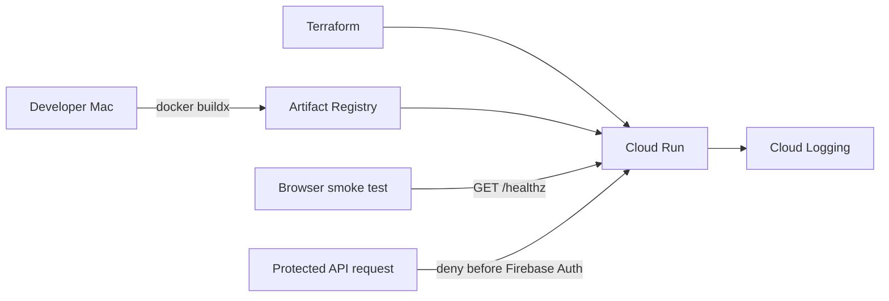

# Stage 5A Cloud Run Bootstrap Design

**Status:** Confirmed

**Date:** 2026-07-14

**Goal:** Deploy the existing FastAPI backend to a cost-controlled Google Cloud development environment and prove the public cloud runtime path before adding persistent data, user authentication, video uploads, or AI workers.

## Scope

Stage 5A delivers one independently testable cloud slice:

- Package the FastAPI service as a production container.
- Store the image in Artifact Registry in `asia-southeast1`.
- Deploy the image to Cloud Run in `asia-southeast1`.
- Expose `GET /healthz` for runtime verification.
- Reject every protected `/v1` operation until Firebase authentication is implemented in a later Stage 5 batch.
- Manage the deployable resources with Terraform and least-privilege service accounts.
- Show the deployed Cloud Run service, request logs, budget, and live health response in Google Cloud Console.

This batch does not create Firestore databases or Cloud Storage buckets, upload user videos, connect the iOS app to the cloud endpoint, run AI inference, enable GPUs, configure Firebase, or create production environments.

## Architecture

The container runs Uvicorn as a non-root user and receives configuration only through environment variables. Cloud bootstrap mode uses an authentication verifier that denies protected requests rather than accepting the development bearer token. The health route remains public so deployment can be verified without introducing temporary credentials.

## Components

### Backend container

- Add a deterministic Docker build based on a supported Python runtime.
- Install only runtime dependencies in the final image.
- Run as a non-root user on Cloud Run's `PORT` value.
- Add a `.dockerignore` so local environments, tests, caches, uploaded objects, and Git metadata never enter the image.
- Keep local development behavior unchanged.

### Cloud-safe application mode

- Extend settings with an explicit `cloud-bootstrap` environment.
- Select dependencies through the application container instead of route-level conditionals.
- Use a deny-all authentication adapter for protected endpoints in cloud bootstrap mode.
- Fail startup for unknown environments rather than silently selecting development authentication.
- Keep request logging free of authorization values, signed URLs, query strings, and request bodies.

### Terraform

- Enable only APIs required by Stage 5A.
- Create one regional Artifact Registry repository.
- Create one dedicated Cloud Run runtime service account without project-wide Editor or Owner roles.
- Deploy one Cloud Run service with public ingress, public invocation, `min_instance_count = 0`, and `max_instance_count = 1`.
- Limit the container to `1` CPU and `512Mi` memory, request-based billing, and a short request timeout.
- Keep deletion protection enabled and expose the service URL as an output.
- Require project ID and immutable container image digest as inputs; do not provide deployable defaults.

## Data And Request Flow

1. The backend test suite and Docker smoke test pass locally.
2. Terraform creates the Artifact Registry foundation without creating compute instances.
3. Docker builds a `linux/amd64` image locally and pushes it with an immutable content digest.
4. Terraform deploys that digest to Cloud Run.
5. A browser requests `/healthz`; Cloud Run may start one instance, returns the health contract, and scales back to zero when idle.
6. A request to a protected `/v1` endpoint receives an authentication rejection and performs no data write.
7. Cloud Logging records request metadata and status without recording credentials or user video content.

Stage 5A stores no user business records. Artifact Registry stores only application images, and Cloud Logging stores operational metadata.

## Cost Controls

- The project budget is `JPY 1,000` per calendar month with alerts at 10%, 50%, 80%, and 100%.
- The budget applies only to `stage-lab-dev-gary-202607`.
- Cloud Run scales to zero and cannot exceed one instance.
- No GPU, always-on worker, VPC connector, load balancer, Cloud SQL, Firestore, Cloud Storage, or Cloud Build resource is enabled in this batch.
- Container builds run locally to avoid Cloud Build usage.
- Artifact image retention is bounded by a cleanup policy so old untagged images do not accumulate indefinitely.
- Budget alerts are monitoring controls, not a hard spending cap. Deployment stops if the required resource limits cannot be verified.

## Failure And Rollback

- A container that fails local health checks is never pushed.
- A pushed image that fails the Cloud Run startup probe does not receive traffic.
- Cloud Run revision history provides rollback to the previous healthy digest.
- Terraform plan must be reviewed before apply and may not contain resources outside the Stage 5A scope.
- Because Stage 5A persists no user data, rollback requires no data migration.

## Verification

- Existing backend tests pass without changes to local behavior.
- New tests prove cloud bootstrap mode denies protected API calls and rejects unknown environments.
- Docker builds for `linux/amd64`, starts locally, and returns the expected `/healthz` payload.
- Container execution is non-root and contains no development object files or credentials.
- `terraform fmt -check`, `terraform validate`, and infrastructure contract tests pass.
- The reviewed Terraform plan contains only Stage 5A resources.
- The deployed `/healthz` endpoint succeeds over HTTPS.
- A protected endpoint is rejected and creates no job or upload.
- Cloud Run reports minimum zero, maximum one, and no GPU.
- The Google Cloud billing page shows the `JPY 1,000` Stage Lab budget.

## Acceptance Boundary

Stage 5A is complete only when the container, Terraform, cloud deployment, live smoke tests, security rejection, cost settings, GitHub push, and Google Cloud Console walkthrough have all been verified. Persistent cloud uploads begin in Stage 5B only after this checkpoint is accepted.
