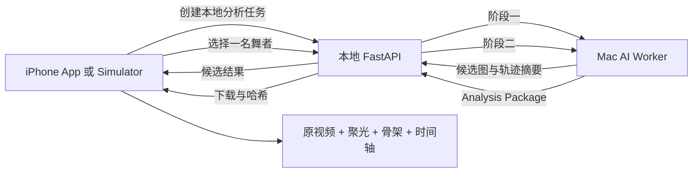

# Stage 6 本地真实 AI 动作分解闭环设计

## 1. 目标

Stage 6 交付一条可在 Xcode 中体验的真实 AI 最小闭环：用户导入舞蹈视频，Mac 本地 AI Worker 检测真实舞者，用户选择一名目标舞者，Worker 生成目标轨迹、人体骨架、动作节点、重复组、难度与节拍，App 下载并保存 Analysis Package，最后在原视频上实时绘制聚光、可开关骨架和动作时间轴。

首轮只使用用户已有的 `82MAJOR Trophy` 练习室视频验收。该结果必须来自真实模型，不得使用固定候选、固定时间轴或伪造分析进度冒充 AI 输出。

## 2. 范围

### 2.1 包含

- MP4、MOV、M4V 本地视频的 FFprobe 媒体检查。
- FFmpeg 生成最高 `720p/30fps`、只降不升的分析代理；原视频不修改。
- RTMDet 人物检测、ByteTrack 多目标追踪和真实候选舞者代表图。
- 用户一次选择一名目标舞者。
- RTMPose 目标舞者姿态、目标框关键帧和置信度区间。
- BPM、节拍和强拍提取，以及动作节点向节拍吸附。
- 基于关节速度、方向变化、位移和节拍的可解释动作边界、重复组与难度。
- App 中的聚光跟随、可开关骨架、动作时间轴、跳转、变速、镜像和循环。
- Analysis Package 的校验、原子保存和离线重新打开。
- Mac Apple Silicon 上优先使用 MPS，模型算子不兼容时自动回退 CPU。

### 2.2 不包含

- Sign in with Apple、任何面向用户的登录页面、Apple Developer Program 前置工作。
- Google Cloud 上传、云端 GPU Worker 或新的付费云服务。
- 主歌、副歌、桥段、Dance Break 等音乐语义识别。
- 大模型教学文案、自拍评分、动作纠错、视频导出、分享、APNs、CloudKit 和 StoreKit。
- 同时对多名舞者运行完整姿态分析。

## 3. 架构



本地 FastAPI 负责任务状态、检查点和结果下载，不直接实现模型。AI Worker 以独立 Python 进程或容器运行，通过稳定的输入输出合同与 API 交互。App 只依赖 API DTO 和 Analysis Package，不依赖模型实现，因此后续可把同一 Worker 容器迁移到 Google Cloud。

Simulator 默认通过 Mac 回环地址连接。真实 iPhone 验收时，开发者显式开启局域网模式，API 每次启动生成一次性临时配对令牌；Debug App 通过 Xcode Scheme 环境注入 Mac 地址和令牌。局域网模式要求同一受信任网络、令牌校验和短期有效期，停止服务后立即失效。测试版不开放公网，也不在 App 源码、仓库、普通配置或日志中保存固定密钥。现有 Fake 服务继续服务 Preview、单元测试和 UI 测试，但真实分析入口必须清楚标识真实或 Demo 状态。

## 4. 两阶段处理

### 4.1 阶段一：媒体与候选舞者

1. FFprobe 检查容器、视频轨道、时长、尺寸、帧率和方向。
2. 拒绝损坏、无视频轨道、DRM、超过 6 分钟或不支持编码的视频。
3. FFmpeg 生成固定时间基准的最高 `720p/30fps` 分析代理。
4. RTMDet 检测人物，ByteTrack 连接跨帧人物框。
5. 按可见时长、框面积、全身可见率和轨迹稳定性生成候选。
6. 每个候选输出多张来自真实视频的代表图、位置说明、出现区间和置信度。

### 4.2 阶段二：目标舞者动作分析

1. 使用用户选定轨迹锁定目标身份。
2. 低成本保留所有人物框以减少换位误切，但只对目标舞者运行完整 RTMPose。
3. 输出目标框和骨架的稀疏关键帧；低置信度区间不得自动切换到其他舞者。
4. 从姿态序列提取关节速度、方向变化、转身近似、身体位移与停顿。
5. 提取 BPM、节拍和强拍，把动作边界吸附到合理节拍。
6. 生成动作片段、易/中/难、难度原因和 `repeatGroupId`。
7. 写入版本化 Analysis Package，生成 SHA-256 后进入可领取状态。

## 5. Analysis Package

首版结果格式：

```text
result-v1.zip
  manifest.json
  spotlight-track.json
  pose-track.json
  timeline.json
  confidence.json
```

- `manifest.json`：schema、模型版本、视频指纹、时间基准、生成时间和各文件哈希。
- `spotlight-track.json`：时间、归一化目标框、可见度、置信度和插值方式。
- `pose-track.json`：时间、归一化关节点、关节点置信度和骨架拓扑版本。
- `timeline.json`：动作片段、难度、原因、节拍、重复组和建议速度。
- `confidence.json`：跟丢、遮挡、剪辑和低可信区间。

所有画面坐标使用 `0–1` 归一化坐标。App 根据视频内容矩形、方向和镜像状态转换坐标。结果先下载到临时目录，逐项校验后原子移动到 Application Support；校验失败时保留旧结果并允许重新领取。

## 6. 成品体验

1. 用户导入视频并点击“开始 AI 分析”。
2. 分析页显示媒体检查、人物检测和候选生成的真实状态。
3. 选舞者页显示真实候选代表图。
4. 用户选择一名舞者后启动第二阶段。
5. 完成后进入练习播放器，默认显示聚光跟随；骨架可开关。
6. 时间轴显示动作片段、难度、重复关系和低置信度提示。
7. 点击片段可跳转，并可配合变速、镜像和循环练习。
8. 关闭本地 API 后，已领取结果仍可离线播放。

## 7. 错误与恢复

- 媒体不支持：分析前终止并显示可执行原因。
- FFmpeg 或模型失败：记录稳定错误码和最后检查点，可重试且不重新导入原视频。
- MPS 算子失败：一次性回退 CPU，并记录执行设备；不得循环重试。
- 目标身份不确定：标记低置信度区间，不伪造完整轨迹。
- 结果哈希错误：拒绝导入并重新领取。
- Worker 被关闭：任务变为可恢复失败，重启服务后从已有代理或检查点继续。
- 日志不得包含原始文件名、绝对路径、视频帧、Token 或完整用户标题。

## 8. 成本、安全与回退

- Stage 6 不创建或启用 Google Cloud GPU，不增加常驻云资源。
- AI 模型、代理、候选图和结果均在开发 Mac 本地保存。
- 中间文件按任务隔离；删除项目时清理本地分析产物。
- 本地 API 默认只监听回环地址；真机验收时才显式开启带短期配对令牌的局域网模式，绝不暴露到公网。
- 引入模型、权重和 Python 依赖前必须记录许可证来源；许可证不允许未来商业使用的组件不得进入正式运行路径。
- 现有 Cloud Run、Firestore 和 Bucket 保持 Stage 5B 状态，不因本阶段改变。
- 如果 Worker 不稳定，可关闭真实分析入口并回退现有 Fake Demo；导入、项目数据和播放器不受影响。

## 9. 测试与验收

### 9.1 自动测试

- 媒体检查：支持格式、损坏文件、无视频轨道、超时长、方向和低分辨率不升格。
- Worker 合同：候选 DTO、归一化坐标、时间单调性、置信度范围和检查点恢复。
- Analysis Package：schema、哈希、原子替换、损坏拒绝和离线读取。
- 动作规则：动作边界、节拍吸附、重复组、难度原因和空音频回退。
- Swift：坐标转换、镜像、轨迹插值、骨架显示、时间轴导入和错误映射。
- UI：真实/演示状态标识、候选选择、分析失败、结果领取和练习入口。

### 9.2 首条视频人工验收

- 正确列出主要舞者，候选图来自 `82MAJOR Trophy` 视频。
- 所选舞者在大部分有效画面内保持同一身份。
- 骨架与身体基本重合，聚光跟随目标且不明显跳到其他舞者。
- 为首条视频人工标记至少 10 个可见动作变化点；AI 动作节点的中位绝对时间误差目标不超过 `0.5` 秒。
- 跟丢或遮挡区间出现黄色低置信度提示。
- 变速、镜像、循环和节点跳转不退化。
- 记录完整分析耗时、峰值内存、执行设备和结果包大小；本阶段不要求实时处理。

## 10. 阶段边界与后续

Stage 6 完成条件是首条视频真实 AI 闭环通过自动测试与人工验收，并能在 Xcode 中稳定展示成品形态。通过后再扩大到 3 条视频验证泛化，然后进入云端 Worker 部署与无账号内部测试授权设计。Sign in with Apple 延后到需要外部 TestFlight 或商品级用户隔离之前，不阻塞真实 AI Demo。
